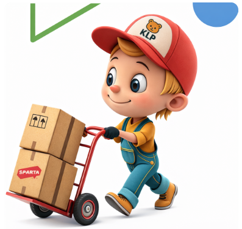
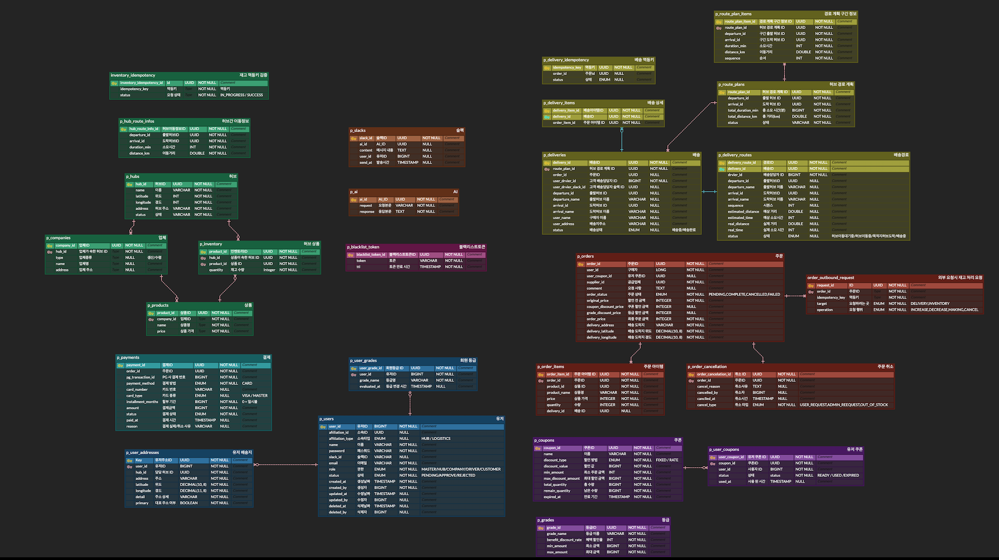
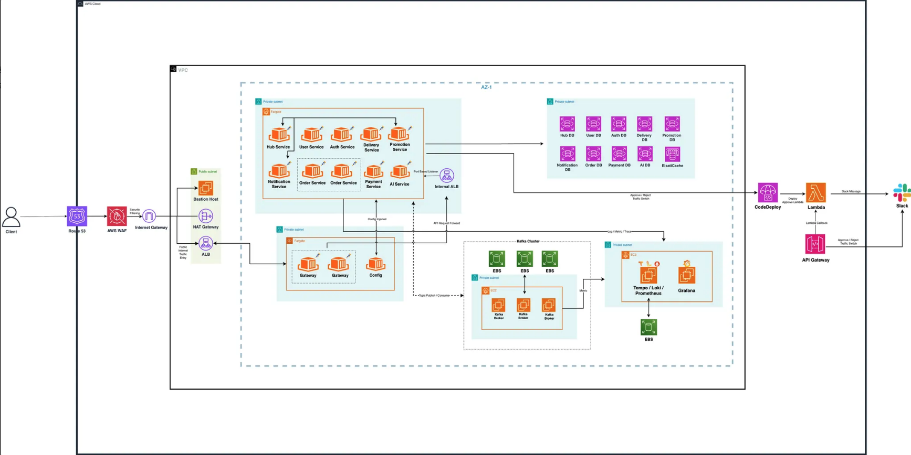
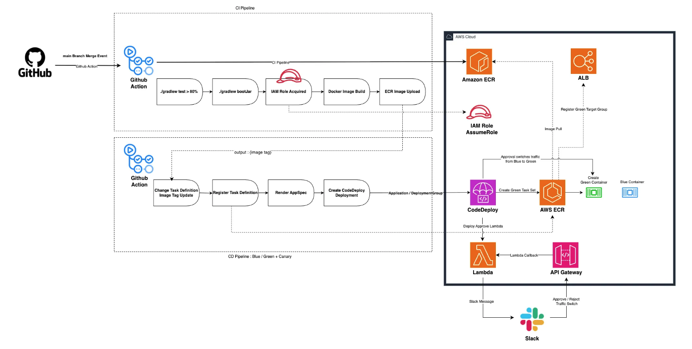
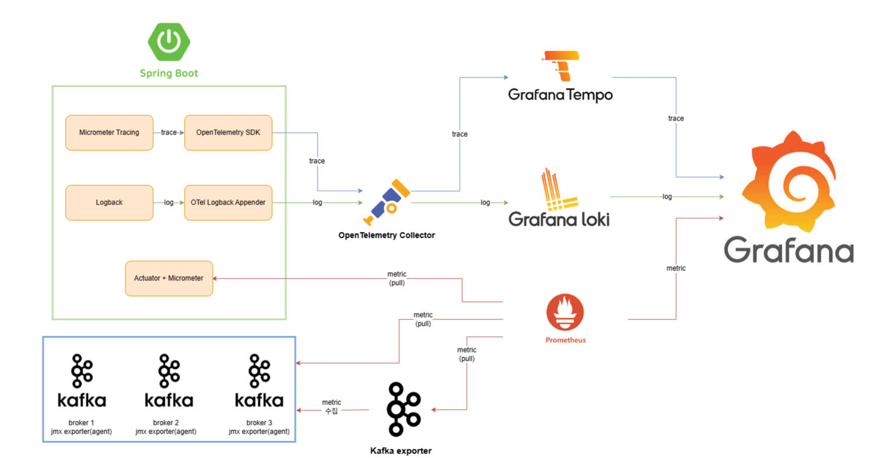

# KimLeePark-Logistics



Redis 분산 락 기반 재고 선점과 Kafka 이벤트 스트리밍을 적용해, 대규모 동시 주문 환경에서도 데이터 일관성을 유지하는 물류 시스템을 구현했습니다.
주문 생성부터 배송까지의 전 과정을 안정적으로 관리합니다.


## ERD
[erd 상세](https://https://www.erdcloud.com/d/aoTEHW2tn5jEtJ538)



## 인프라 설계도



## 배포 파이프라인



## 로그



## 주요 기술 스택

<div align="center">

### **애플리케이션**


### **인증 및 보안**


### **데이터베이스**


### **메시징 & 이벤트 스트리밍**


### **빌드 도구**


### **CI/CD & 인프라**


### **모니터링 & 관찰성**


### **기타**


</div>

## 패키지 구조

```
{service-name}/
├── presentation/          # 프레젠테이션 레이어
│   ├── controller/       # REST API 컨트롤러
│   └── dto/              # 요청/응답 DTO
├── application/          # 애플리케이션 레이어
│   ├── facade/           # Facade 패턴 (복잡한 비즈니스 로직 조율)
│   ├── service/          # 애플리케이션 서비스
│   ├── command/          # 명령 객체 (CQRS)
│   ├── query/            # 쿼리 서비스 (CQRS)
│   ├── cache/            # 캐시 관리
│   └── event/            # 이벤트 핸들러
├── domain/               # 도메인 레이어
│   ├── entity/           # 도메인 엔티티
│   ├── repository/       # 리포지토리 인터페이스
│   └── vo/               # 값 객체 (Value Object)
└── infrastructure/       # 인프라스트럭처 레이어
    ├── client/           # 외부 서비스 클라이언트 (Feign)
    ├── event/             # 이벤트 발행/구독
    └── repository/       # 리포지토리 구현체 (JPA)
```

### 레이어별 책임

- **Presentation Layer**: HTTP 요청/응답 처리, 유효성 검증
- **Application Layer**: 비즈니스 로직 조율, 트랜잭션 관리, 외부 서비스 호출
- **Domain Layer**: 핵심 비즈니스 로직, 도메인 규칙, 엔티티
- **Infrastructure Layer**: 외부 시스템 연동, 데이터 영속성, 기술적 세부사항

### 주요 기능

#### 🔒 재고 및 주문 동시성 제어 흐름

* 재고 수량 검증 및 차감은 **Redis Lua 스크립트**를 통해 원자적으로 처리
* 결제 성공 시 선점된 재고를 **확정(Confirm)** 하고 실제 재고 차감 수행
* 결제 결과에 따라 선점된 재고를 확정 또는 즉시 복구하도록 처리
* 중복 요청이나 재시도 상황에서도 동일한 결과를 보장하기 위해 **멱등키 기반 요청 처리** 적용

#### 📦 Kafka 기반 비동기 주문 처리 흐름

* 주문 요청은 동기 처리로 묶지 않고 **Kafka 기반 메시징 시스템**을 통해 비동기 처리
* 주문 생성 이후의 재고 처리, 결제, 배송 생성은 **Choreography 방식의 이벤트 흐름**으로 처리
* 각 단계는 이전 단계 이벤트를 구독해 처리 결과에 따라 **Success / Failed 이벤트**를 발행
* 이벤트 소비 실패 시 **DLT(DLQ)** 로 메시지를 분리하여 후속 처리

#### 🔁 Outbox & Saga 기반 분산 트랜잭션 관리

* DB 트랜잭션과 이벤트 발행 간 불일치를 방지하기 위해 **Outbox 패턴** 적용
* 스케줄러 기반 Outbox 퍼블리셔가 Kafka로 이벤트를 발행
* 주문·재고·결제·배송 간 흐름은 **Saga 패턴**기반인 Choreography로 관리
* 중간 단계 실패 시 이전 상태로 되돌리기 위한 **보상 트랜잭션** 수행

#### 📢 알림 처리

* 배송 생성 완료 시 배송 생성 이벤트 발행
* AI 기반 메시지 생성 후 **Slack Webhook**을 통해 배송 담당자에게 전송
* 알림 실패는 재시도 또는 별도 처리되며, **주문·배송 흐름에는 영향 없음**

#### 🤖 RAG 기반 AI 상품 추천 처리 흐름

* 주문 생성 이벤트를 수신하여 추천 생성 파이프라인 트리거
* 주문 상품명을 기준으로 **Vector Store 기반 유사 상품 검색** 수행
* 사용자 허브 정보, 주문 이력, 시간대, 날씨 등 **컨텍스트 정보 수집**
* 검색 결과와 컨텍스트를 결합하여 **LLM 기반 추천 결과 생성**

#### 💾 멀티 레벨 캐시 기반 조회 최적화

* 자주 조회되는 데이터는 **L1(Local) + L2(Redis) 멀티 레벨 캐시** 구조로 관리
* L1 Cache (Caffeine)는 애플리케이션 인스턴스 내에 존재하며 초저지연(sub-millisecond) 응답 제공
* L2 Cache (Redis)는 분산 환경에서 다중 인스턴스 간 데이터 공유 및 일관성을 유지
* **Probabilistic Early Refresh(PER)** 를 통해 캐시 만료 시점을 분산시켜 캐시 스탬피드(Cache Stampede) 방지 및 최신 데이터 제공
* **Negative Caching** 으로 존재하지 않는 데이터(null)를 캐시하여 불필요한 DB 조회 방지

#### 📊 모니터링 및 운영 흐름

* **Prometheus**를 통해 각 서비스의 HTTP 메트릭(QPS, Latency, 에러율 등)을 수집
* **Grafana**를 활용해 트래픽, 지연 시간, 에러율 등을 시각적으로 모니터링
* 분산 환경의 요청 흐름 추적을 위해 **OpenTelemetry 기반 트레이싱** 적용하여 문제 발생 시 신속한 원인 분석

## 트러블슈팅

### 1. 커스텀 헤더 강제 주입 보안 취약점

**문제 상황**

- Gateway에서 JWT 토큰을 검증한 후 `X-User-Id`, `X-User-Name`, `X-User-Role` 커스텀 헤더를 주입하여 각 서비스로 전달
- 각 서비스의 `AuthorizationFilter`는 이 커스텀 헤더를 받아 SecurityContext에 설정하여 권한을 부여
- 외부 사용자가 HTTP 요청에 `X-User-Role: MASTER` 같은 헤더를 임의로 주입하면 권한을 우회할 수 있는 보안 취약점 존재

**해결 방법**

- `/v1/internal/` 경로를 내부 서비스 간 통신 전용 API로 분리
- 내부 API는 Gateway를 거치지 않고 서비스 간 직접 호출(Feign Client 등)하여 헤더 강제 주입 공격 방지
- 이를 통해 외부에서 임의의 헤더를 주입하더라도 내부 API에 접근할 수 없도록 보안 강화

📌 트러블 슈팅 상세 문서
[재고차감 관련 트러블슈팅 문서](https://www.notion.so/teamsparta/2cd?source=copy_link)

## 🐋 Docker-compose 실행 방법

### 환경 변수 설정

프로젝트는 Spring Cloud Config Server를 통해 config-repo에서 애플리케이션 설정을 관리하며, Docker Compose를 통해 인프라 서비스를 구성합니다.
docker-compose.yml 파일에 아래 환경 변수를 설정해야 합니다.

#### Infra & Server 환경 변수

```yaml
# Database
{POSTGRES_USER}
{POSTGRES_PASSWORD}
{REDIS_PASSWORD}

# Spring Cloud Config
{CONFIG_REPO_URI}
{GIT_USERNAME}
{GIT_TOKEN}

#Kafka  
{KAFKA_BOOTSTRAP_SERVERS}
```

### 실행

```bash
# 인프라 실행 (PostgreSQL, Redis, Kafka...)
docker-compose up -d

# (선택) 모니터링 실행
# telemetry 디렉토리로 이동
cd telemetry
docker-compose up -d
```

### 서비스 관리 명령어

```bash
# 실행 중인 모든 서비스 상태 확인
docker-compose ps

# 특정 서비스의 실시간 로그 확인
docker-compose logs -f [service-name]

# 전체 서비스 중지 및 컨테이너 제거
docker-compose down
```

### 접속 정보

- Grafana: http://{GRAFANA_HOST}:{GRAFANA_PORT}
- Kafka UI: http://{KAFKA_UI_HOST}:{KAFKA_UI_PORT}
- Swagger: http://{SWAGGER_HOST}:{SWAGGER_PORT}/swagger-ui.html

# 👥 Team Members


| 이름 | 역할    |
| ---- | ------- |
| 김OO | Backend |
| 이OO | Backend |
| 박OO | Backend |
