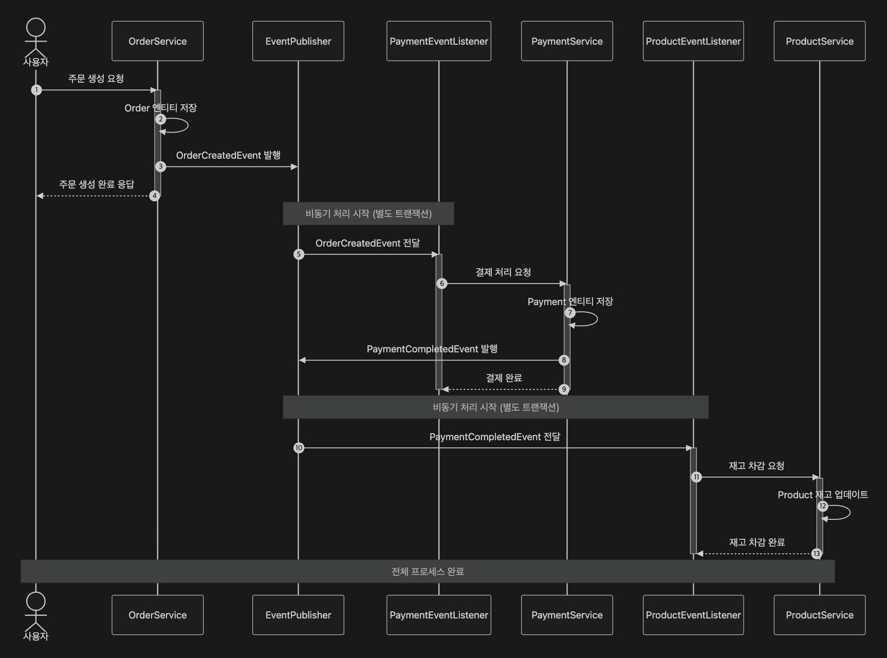
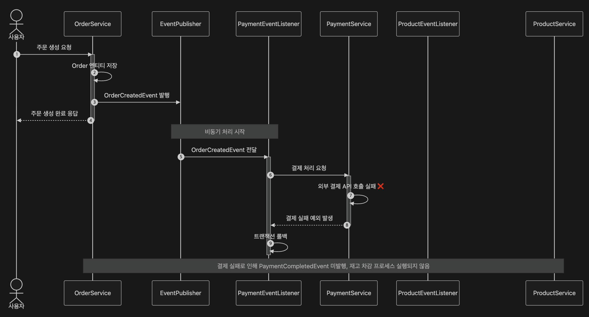
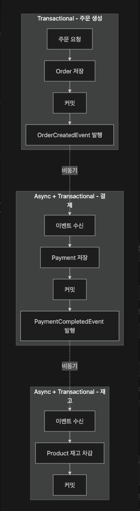
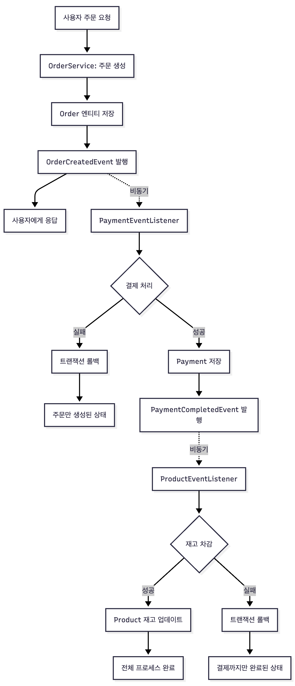

# 이벤트 기반 구조 - KimLeePark

## 📋 목차

- [프로젝트 소개](#프로젝트-소개)
- [프로젝트 구조](#프로젝트-구조)
- [실행 방법](#실행-방법)
- [이벤트 플로우 다이어그램](#이벤트-플로우-다이어그램)
- [트랜잭션 격리 도식화](#트랜잭션-격리-도식화)
- [사용자 플로우](#사용자-플로우-다이어그램)
- [트러블슈팅](#트러블슈팅)
- [학습 회고](#학습-회고)

---

## 프로젝트 소개 

Spring Event 를 활용한 이벤트 기반 아키텍쳐 프로젝트입니다.

주문 생성부터 결제, 재고차감까지 이벤트 체인을 통해 처리합니다.

---

## 프로젝트 구조

```
order/
│
├── common/                          # 공통 모듈
│   ├── config/
│   │   └── AsyncConfig              # 비동기 설정
│   └── event/
│       ├── DomainEvent              # 이벤트 인터페이스
│       ├── EventPublisher           # 발행자 인터페이스
│       └── SpringEventPublisher     # Spring Event 구현체
│
├── order/                           # 주문 도메인
│   ├── application/service/
│   │   └── OrderService
│   ├── domain/
│   │   ├── entity/                  # 주문 엔티티
│   │   └── event/
│   │       └── OrderCreatedEvent    # 주문 생성 이벤트
│   └── infrastructure/repository/
│
├── payment/                         # 결제 도메인
│   ├── application/service/
│   │   ├── PaymentService
│   │   └── PaymentEventListener     # 주문 이벤트 리스너
│   ├── domain/
│   │   ├── entity/                  # 결제 엔티티
│   │   └── event/
│   │       └── PaymentCompletedEvent # 결제 완료 이벤트
│   └── infrastructure/
│       ├── clients/                 # 외부 결제 API
│       └── repository/
│
└── product/                         # 상품 도메인
    ├── application/service/
    │   ├── ProductService
    │   └── ProductEventListener     # 결제 이벤트 리스너 (재고 차감)
    └── domain/
        ├── entity/                  # 상품 엔티티
        └── repository/
```

---

## 실행 방법 

```bash
1. 데이터베이스 설정
docker-compose up -d

2. 빌드
cd order

# Gradle Wrapper를 사용한 빌드
./gradlew clean build

# 테스트 제외하고 빌드
./gradlew clean build -x test

3. 실행

# Gradle을 통한 실행
./gradlew bootRun

# 또는 빌드된 JAR 파일 실행
java -jar build/libs/order-0.0.1-SNAPSHOT.jar

4. 테스트 실행

# 전체 테스트 실행
./gradlew test
```

---

## 이벤트 플로우 다이어그램

### 정상 플로우 



### 결제 실패 플로우 



---

## 트랜잭션 격리 도식화 



---

## 사용자 플로우 다이어그램



---

## 트러블 슈팅 

**비동기 테스트**

- 비동기 테스트시 `Thread.sleep()` 이 아닌 `Awaitility` 를 사용하게 되었는데 해당 라이브러리는 "특정 조건이 만족될 때까지 주기적으로 확인(polling) 하는 라이브러리"이다 
```java
await()
    .atMost(5, TimeUnit.SECONDS)
    .untilAsserted(() -> {
        // 이 조건이 true가 될 때까지 반복 확인
        assertThat(payment.getStatus()).isEqualTo(PaymentStatus.COMPLETED);
    });
```
- **테스트를 잘 못 작성할 경우 주기적으로 조건을 확인하기 위해 쿼리를 계속 실행하게 됨**

**이벤트 리스너 테스트**

- `SpringBootTest` 를 적용한 경우 여러개의 이벤트 리스너가 빈으로 등록되는데 특정 이벤트 리스너의 테스트가 복잡함 
  - 독립된 이벤트 리스너 테스트가 필요하다면 `SpringBootTest` 가 아닌 단위 테스트로 변경

---

## 학습 회고

**Keep**

- 이벤트 기반 구조를 통해서 각 서비스간의 의존도가 줄어듦 
- 비동기 테스트시 `Thread.sleep()` 으로 고정된 대기 시간이 아닌 `Awaitility` 를 적용하여 유연하게 테스트를 하도록 함
- 이벤트, 이벤트 발행 등을 추상화하여 특정 기술의 의존도를 최대한 낮춤

**Problem**

- 이벤트 발행시 서버에 문제가 생기면 이벤트가 유실되는 문제 
- 비동기 이벤트 발행시 순서 보장이 어려움 
- 각 이벤트가 비동기로 처리되므로 재고 차감 실패시 -> 결제 실패 -> 주문 취소의 흐름으로 롤백이 되어야 함

**Try**

- 이벤트 유실을 해결하기 위한 방법을 적용
  - Outbox 패턴
- 이벤트 발행의 순서를 보장하기 위한 방법을 적용 
  - @Version 을 통한 순서 보장 혹은 커스텀한 시퀀스 번호를 추가 
- 원자적으로 처리되어야 하는 경우 
