## 테스트 1: 라우팅 검증

### 라우팅 테스트

- Order Service
  - 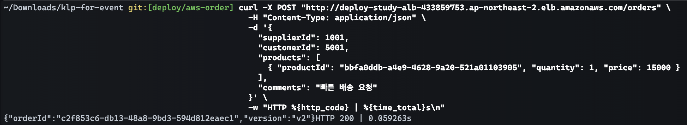
- Payment Service
  - 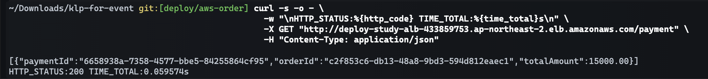
- Product Service
  - 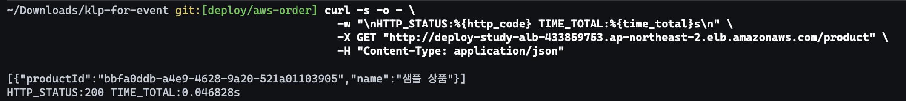
- ALB 리소스 맵 
  - 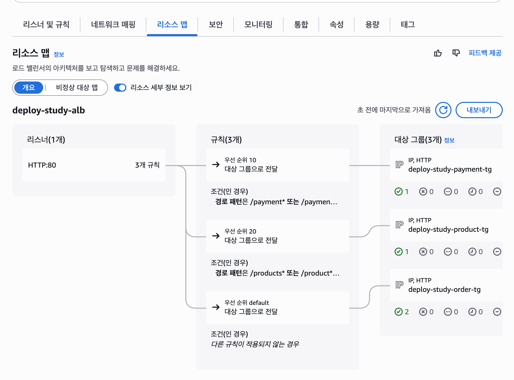
- ALB 
  - 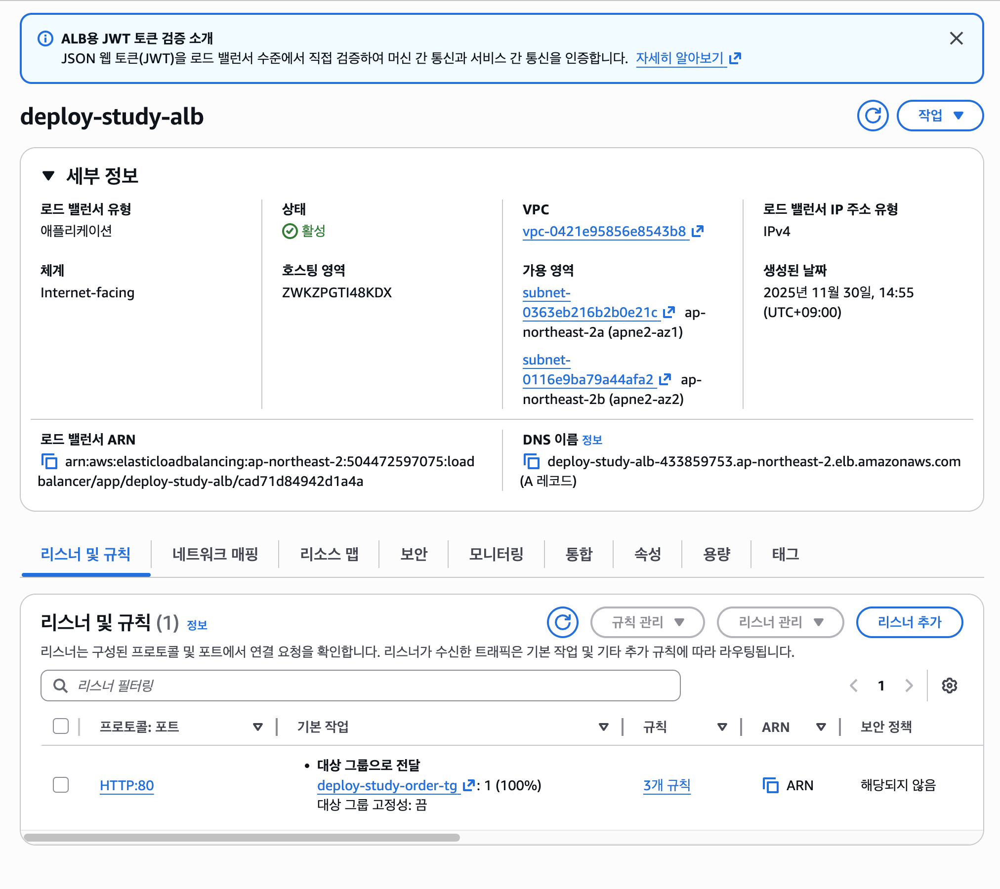

### 결과 

| **엔드포인트** | **응답 코드** | **응답 시간** | **성공 여부** |
|-----------| --- |-----------| --- |
| /orders   | 200 | 592ms     | ✅ |
| /payment | 200 | 595ms     | ✅ |
| /product  | 200 | 468ms     | ✅ |

---

## 테스트 2: 헬스체크 테스트

- ECS Cluster Order Service
  - 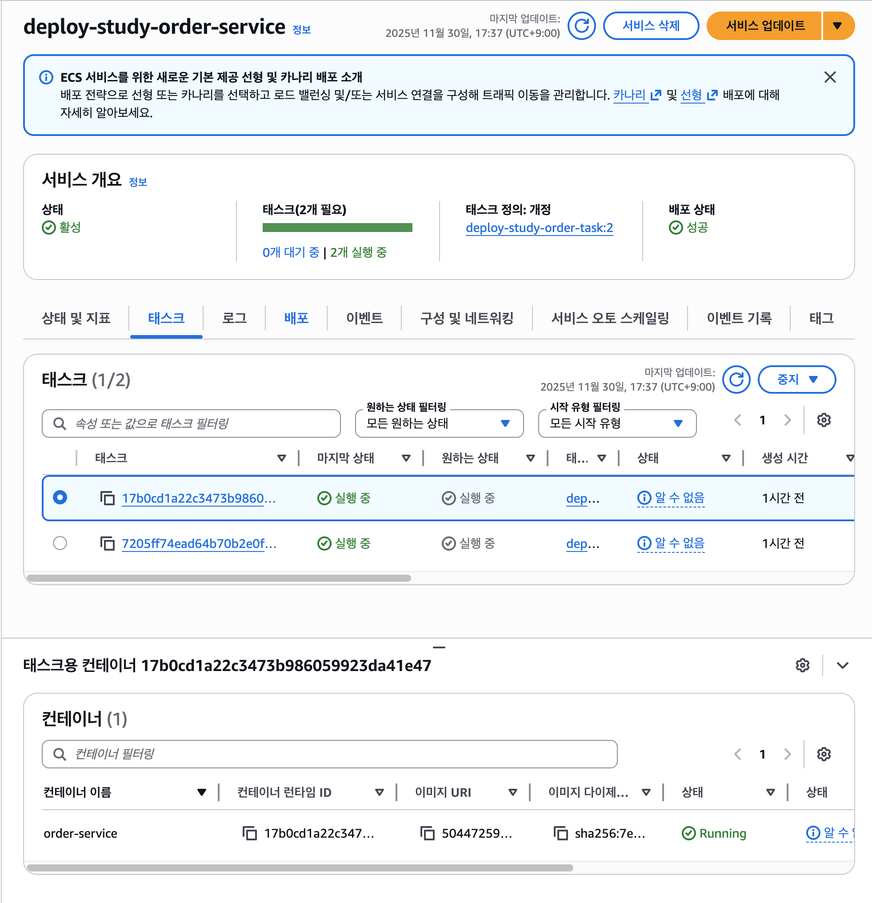

### 타임라인 

| 시각                  | 이벤트                                        |
|---------------------| ------------------------------------------ |
| 2025-11-30T17:44:00 | 테스트 시작 (Order-Service 정상: Task 2개 Healthy) |
| 2025-11-30T17:44:07 | Task 1개 stop-task로 강제 종료                   |
| 2025-11-30T17:44:20 | TargetGroup에서 Unhealthy 감지                 |
| 2025-11-30T17:45:00 | ECS가 새 Task 생성 시작                          |
| 2025-11-30T17:45:00            | 새 Task Running                             |
| 2025-11-30T17:45:00            | 새 Task Healthy                             |
| 2025-11-30T17:45:00            | 서비스 완전히 정상화                                |

### ECS 클러스터 이벤트 

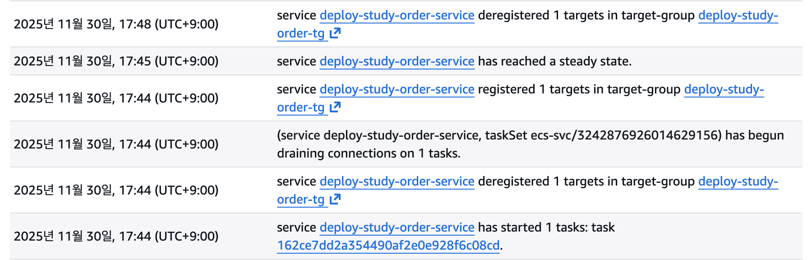

### Task 강제 Stop 

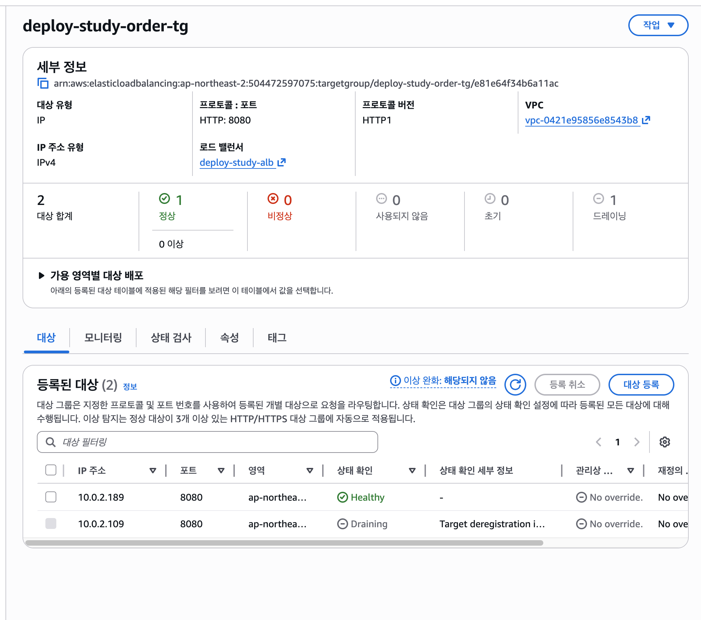

### 결론 

Order-Service 는 Task 강제 종료 상황에서도 평균 50초 내로 새 Task 를 자동으로 생성하고 정상화했습니다.

---

## 테스트 3: 무중단 배포 테스트 

### 배포 과정 

1. 새로운 이미지 태그를 통해 ECR 배포 
2. Terraform 을 통해 변경 
3. ECS 의 롤링 배포로 무중단 배포
4. 배포 완료 

### 테라폼 새로운 이미지 태그로 설정된 tfvars

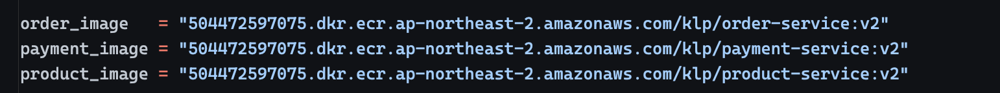

### 주문 생성 curl (3초 간격으로 요청)

```bash
ALB_URL="http://deploy-study-alb-433859753.ap-northeast-2.elb.amazonaws.com"
                                                 
while true; do
 response=$(curl -s -o - \
   -w " HTTP_CODE:%{http_code} TIME:%{time_total}\n" \
   -X POST "${ALB_URL}/orders" \
   -H "Content-Type: application/json" \
   --data-binary "@order_body.json")

 echo "$(date '+%H:%M:%S') $response" | tee -a orders_deploy_test.log

 sleep 3
done
```

### terraform 배포 

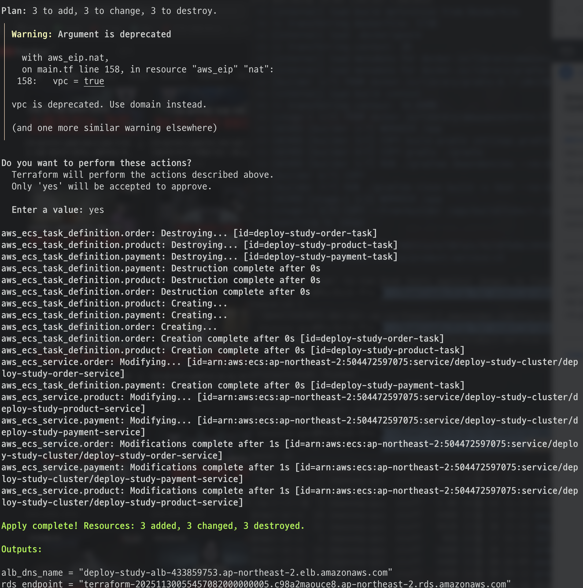

### 실제 테스트 결과 

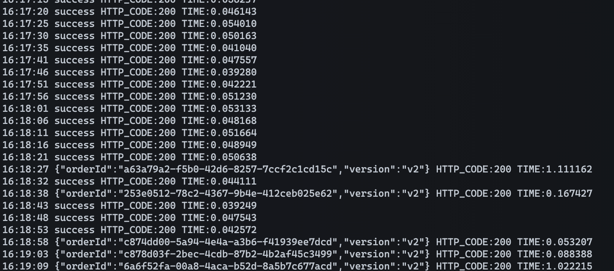

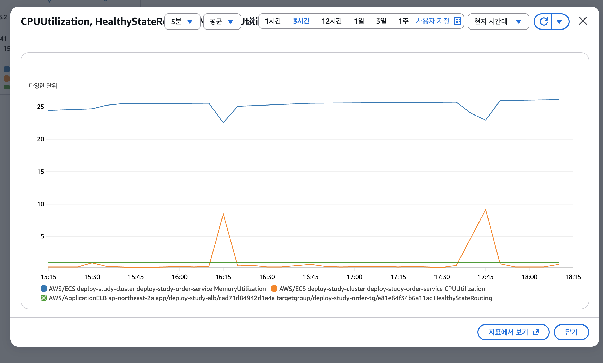

- 새로운 버전으로 배포를 해도 모든 요청은 성공되었으며 `v2` 버전 배포가 완료된 시점에 특정 트래픽은 새로운 버전으로 트래픽을 이동함
