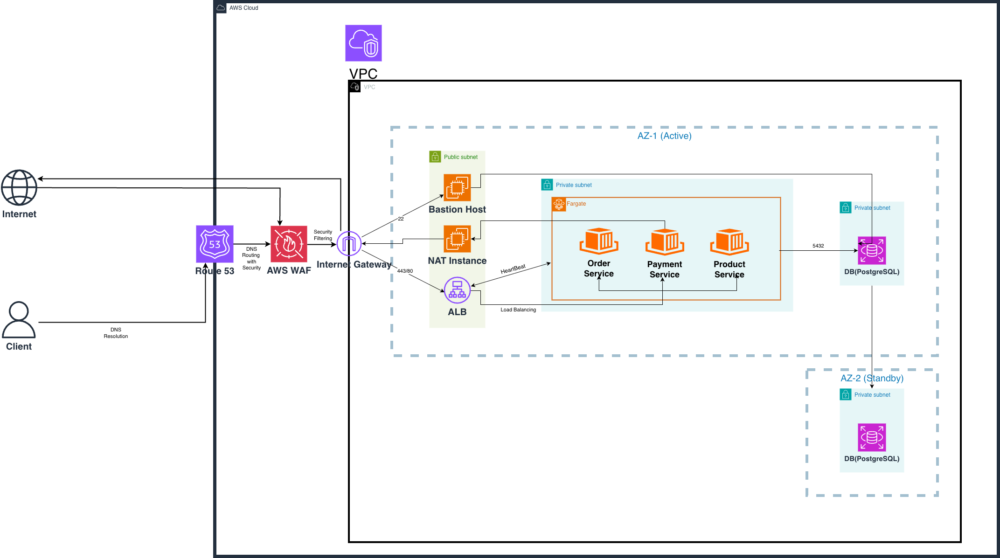
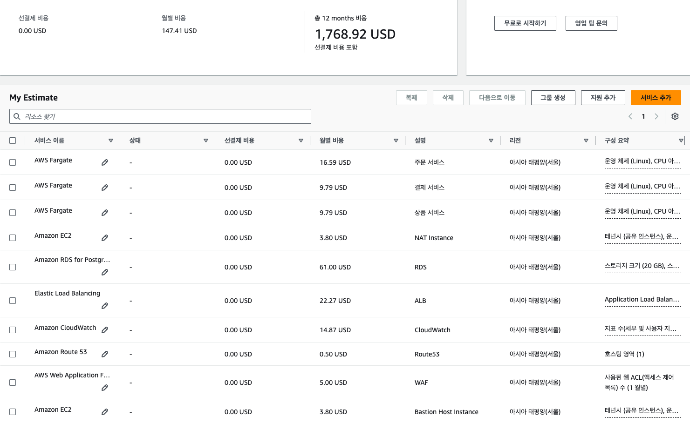
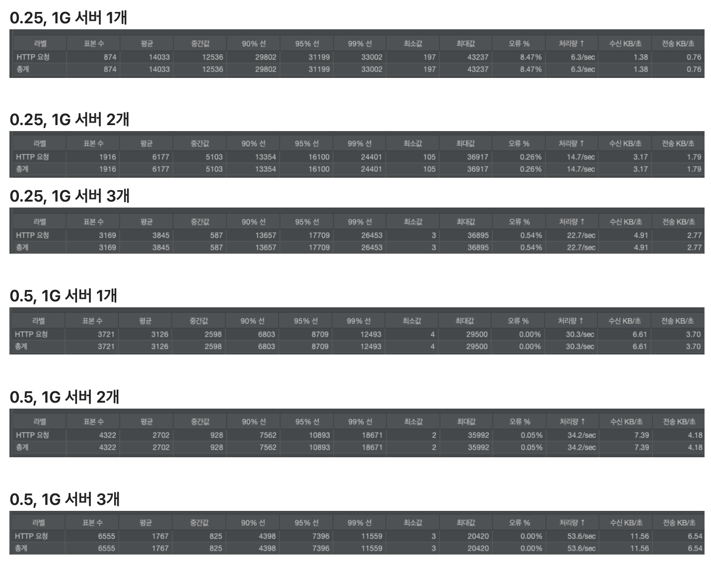
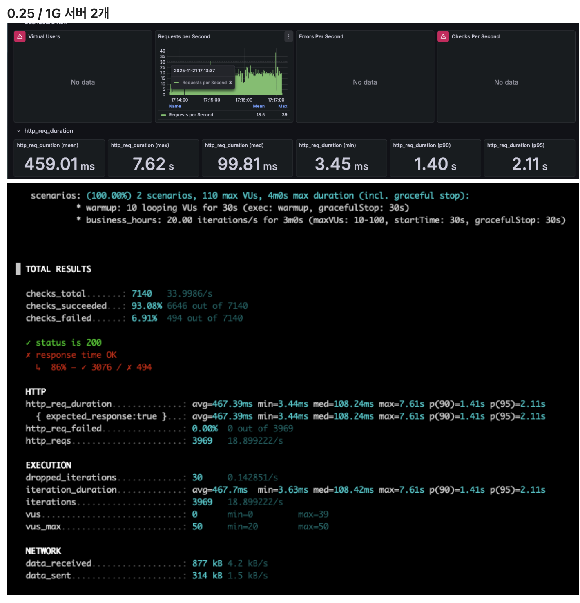
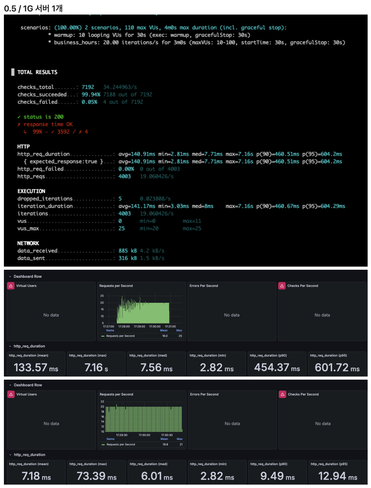
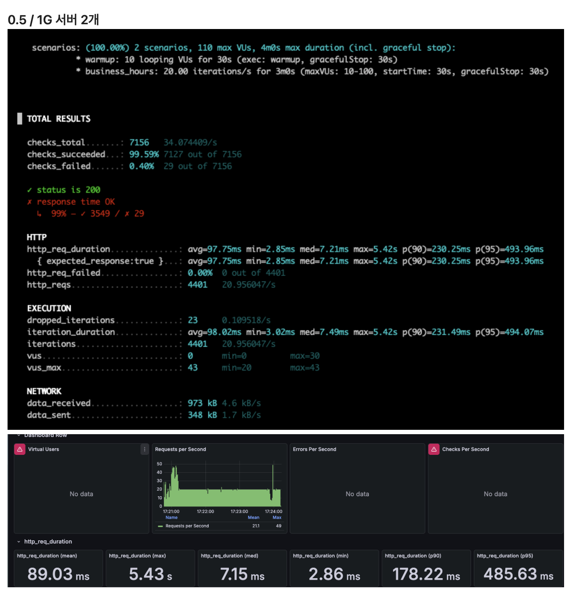

# 운영팀장님 요구사항 분석 및 해결

## 발생할 수 있는 장애 시나리오

| 장애 종류                   | 발생 원인                | 자동 복구 가능 여부 | 복구 방법                                 | **예상 복구 시간** | **활용할 AWS 기능**                       |
|-------------------------|----------------------|-------------|---------------------------------------|--------------|--------------------------------------|
| 애플리케이션 장애               | Out of Memory        | O           | Task 자동 재시작                           | 2~3분         | AWS ECS Health Check                 |
| EC2 Host 하드웨어 장애        | ECS 물리서버 고장          | O           | AWS에서 Task를 다른 호스트로 이전                | 1~2분         | ECS Task Placement, EC2 Status Check |
| 애플리케이션 데드락              | 데드락, 무한 루프로 인한 응답 불가 | O           | Health Check 실패 감지 후 Task 교체          | 3~5분         | ECS Health Check                     |
| AWS 가용 영역 전체 장애         | AWS 데이터센터 장애         | O           | 다른 가용영역의 Task로 트래픽 자동 전환              | 1~2분         | Multi-AZ 배포                          |
| RDS Primary DB 장애       | DB 인스턴스 크래시, 하드웨어 장애 | O           | Standby DB를 Primary로 자동 승격(Fail Over) | 1~2분         | RDS Multi-AZ Fail Over               |
| ALB Target 모두 Unhealthy | 모든 컨테이너가 동시에 응답 불가   | X           | 담당자가 직접 문제 해결                         | 10분 이상       | CloudWatch Alarms                    |

## 장애 시나리오에 대한 설명

### 애플리케이션 장애

> 저희 서버가 너무 많은 메모리를 사용해서 감당하지 못해서 멈춰버리는 상황입니다. 컴퓨터 프로그램이 **“응답 없음”** 상태가 되는 것과 같습니다.
>
> 장애 상황이 발생한다면, 시스템이 문제를 스스로 감지하여 고장난 프로그램을 강제로 종료하고 새로 시작합니다.
>
> 관리자의 개입 없이도 자동으로 복구 되며, 복구 시간은 대략 2~3분 정도 걸리게 됩니다.

### EC2 Host 하드웨어 장애

> 서버를 빌려주는 쪽에서의 실제 컴퓨터가 고장나는 경우입니다. 디스크가 망가지거나 전원이 나가는 상황 등이 존재합니다.
>
> 서버 빌려주는 쪽(AWS)에서 고장난 서버를 감지하고, 정상적으로 작동하는 다른 서버로 우리 프로그램을 옮겨줍니다.
>
> 관리자의 개입 없이도 자동으로 진행되며, 복구 시간은 대략 1~2분 정도 걸리게 됩니다.

### 애플리케이션 데드락

> 프로그램에서 버그가 발생해서 프로그램이 전원은 켜져있지만, 동작하지 않는 상태입니다. 전화를 걸어도 받지 않아 부재중 전화가 남는 상황과 유사합니다.
>
> 저희가 설정해둔 감시자가 30초마다 전화를 잘 받는지 확인하고, 3번 이상 받지 않을 경우 해당 프로그램을 강제로 종료하고 새 것으로 교체합니다
>
> 관리자의 개입 없이도 자동으로 진행되며, 복구 시간은 대략 3~5분 정도 걸리게 됩니다.

### AWS 가용 영역 전체 장애

> 서버를 빌려주는 쪽의 건물과 같은 곳에서 화재나 정전 등이 발생하는 극단적인 상황입니다.
>
> 따라서 우리 서비스는 항상 최소 2개의 다른 건물에서 동시에 운영하도록 설정해둡니다. 만약 위와 같은 상황이 발생 시 사용자의 요청을 정상적으로 동작하는 곳으로만 전달합니다.
>
> 고객은 장애를 느끼지 못하며 1~2분 정도 서버가 조금 느려지는 듯한 기분을 받을 수 있습니다.

### RDS Primary DB 장애

> 고객의 정보를 저장하는 저장소가 갑자기 고장나는 상황입니다.
>
> 우리 서비스의 경우 저장소가 고장날 때를 대비해 예비용 저장소를 미리 설정해뒀습니다.
>
> 메인 저장소가 고장날 경우, 자동으로 예비 저장소를 메인 저장소로 승격시켜서 사용하게 됩니다.
>
> 관리자의 개입 없이도 자동으로 진행되며, 복구 시간은 대략 1~2분 정도 걸리게 됩니다.

### ALB Target 모두 Unhealthy

> 저장소의 열쇠가 변경되었거나, 외부 API(협력사)에 장애가 발생해서 우리 서비스에도 영향을 주는 문제 상황입니다.
>
> 이 경우에는 재시작을 하더라도 문제를 해결할 수 없기 때문에 위와 같은 문제 상황 발생 시 감시자가 담당자에게 긴급 알림을 보내게 됩니다.
>
> 연락을 받은 담당자가 직접 원인을 찾아서 수정하게 되며, 수동으로 문제를 해결하기에 10분 이상의 복구 시간이 걸리게 됩니다.

# 비즈니스 팀장님 요구사항 분석 및 해결

## 학습 내용 정리

### Auto Scaling이란

- 부하 변화에 따라 서버(혹은 컨테이너) 개수를 자동으로 조절하는 기술
- 트래픽이 증가하면 인스턴스를 늘리고, 감소하면 자동으로 줄임 → 비용 절감 + 안정성 확보

### AWS Auto Scaling이란

AWS가 제공하는 여러 Auto Scaling 옵션을 묶어 부르는 개념이며 종류에 따라 다르게 적용된다.

- **EC2 Auto Scaling** → EC2 서버 개수를 자동으로 조절
- **ECS Service Auto Scaling** → 컨테이너(Task) 개수를 자동으로 조절
- **DynamoDB Auto Scaling** → 테이블 용량 자동 조절
- **Aurora Auto Scaling** → Reader 인스턴스 자동 증가

### ECS Auto Scaling 적용 원리

Auto Scaling 대상은 EC2가 아닌 ECS의 컨테이너 개수에 적용된다

- **Application Auto Scaling** → ECS Service Auto Scaling에 연결
- **Scaling Policy 적용**
    - Target Tracking
    - Step Scaling
    - Scheduled Scaling
- 지표(CloudWatch) 기반으로 Task 수 조절

1. CloudWatch 지표 수집
2. Scaling Policy가 임계값 비교 → Scale in/out 판단
3. Application Auto Scaling이 명령 실행
4. ECS가 실제 리소스를 생성/삭제
5. ALB(Target Group)가 Health Check 후 트래픽 분배

### EC2 Auto Scaling

EC2 서버 개수를 자동으로 늘리고 줄이는 것을 뜻한다.

- 트래픽 증가 → EC2 늘림, 트래픽 감소 → EC2 줄임
- 인스턴스 장애 → 자동 재생성(Self-Healing)

### EC2 Auto Scaling Group(ASG)

EC2 인스턴스를 묶어서 자동으로 증감시키는 단위를 뜻한다

- **Min Size**: 최소 개수
- **Max Size**: 최대 개수
- **Desired Capacity** : 목표 개수
- ASG는 항상 Desired Count를 유지하려고 한다.

| 항목             | ECS Auto Scaling  | EC2 Auto Scaling |
|----------------|-------------------|------------------|
| 스케일링 대상        | Task(컨테이너)        | EC2 서버           |
| 관리 난이도         | 낮음(서버 관리 필요 없음)   | 높음(서버 직접 관리)     |
| 비용             | 사용한 만큼 Fargate 과금 | EC2 인스턴스 과금      |
| Scaling Policy | Service 단위        | ASG 단위           |

### Auto Scaling 정책 종류

- **Target Tracking(AWS 권장)**
    - CPU 70% 유지
    - RequestCountPerTarget 50 유지
- **Step Scaling**
    - CPU 80% → Task 2개 증가
    - CPU 90% → Task 4개 증가
- **Scheduled Scaling**
    - 특정 시간대에 원하는 값으로 확장

## 전략 제시 & 설득 논리

| 단계  | 시기             | 목표          | 구현 내용                            | 위험 관리             |
|-----|----------------|-------------|----------------------------------|-------------------|
| 1단계 | 지금(런칭)         | 안정적 서비스 시작  | 고정 Task 개수, 수동 조절                | CloudWatch 모니터링   |
| 2단계 | 1~2주 후         | 자동 확장 적용    | Auto Scaling 설정(Target Tracking) | 부하 테스트 및 정책 검증    |
| 3단계 | 블랙프라이데이 1~2주 전 | 예측 기반 사전 확장 | Scheduled Scaling + Warm Pool 도입 | 피크 시간대 대응 시나리오 검증 |

### 1단계

장애 없이 안정적으로 런칭하는 것을 목표로 합니다. 트래픽이 매우 많이는 발생하지 않을 것으로 생각해 Auto Scaling을 적용하지는 않습니다.

추후 실제 사용량에 대한 데이터를 1주일 이상 수집하여 이에 맞는 Auto Scaling 정책을 적용하는 것을 목표로 합니다.

이렇게 적용할 경우, 런칭 초기 단계에서 불필요한 비용이 증가하는 것을 예방할 수 있습니다.

### 2단계

수집된 실제 사용량을 기반으로 Auto Scaling 설정을 적용합니다. CPU 평균 값, RPS, p95 수치 분석 등을 통해 적정값을 설정합니다.

현재 적용하려는 시스템의 스펙 상, CPU가 부족할 부분이 많다고 판단되기 때문에 CPU 평균 값을 기반으로 60~70%의 평균값을 유지할 수 있는 서버 대수로의 확장을 시도합니다.

하지만, 악성 공격 등에 대비하여 최대 Task 수를 설정할 예정입니다.

### 3단계

기존의 사용량이 아닌 블랙프라이데이라는 특수한 환경에 대한 대비를 마련해야 합니다. 이벤트 당일 Task를 사전 증가시키는 Scheduled Scaling을 적용합니다.

다른 서비스에 비해 비교적 많이 사용될 것이라고 판단되는 주문 서비스와, 안정적인 환경을 구성해야 하는 결제 서비스에 대해 가중치를 높게 설정합니다.

또한 Auto Scaling 하더라도 서버가 생성되고 실행되는 시간이 발생하면 즉각저인 대응이 이루어질 수 없기 때문에, Warm Pool을 사용해 스케일아웃 지연을 제거합니다.

수집된 데이터 및 별도의 부하 테스트를 진행하여 블랙 프라이데이 상황에 대한 RPS를 계산하고 스파이크 테스트를 통해 응답 지연 시간 및 에러율을 파악할 예정입니다.

최대 Task를 달성했음에도 예상보다 더 많은 트래픽이 몰려 추가적인 서버가 필요할 경우가 발생할 수도 있어, 모니터링 시스템을 통해 즉각적으로 판단하고 수동으로 스케일링을 하기 위한 준비도 진행할 예정입니다.

# 보안팀장님 요구사항 분석 및 해결

## 네트워크 다이어그램

## Security Group 규칙 표

### ALB Security Group(sg-alb)

| 타입       | 프로토콜  | 포트   | 소스        | 설명                 |
|----------|-------|------|-----------|--------------------|
| Inbound  | HTTP  | 80   | 0.0.0.0/0 | 전 세계에서 HTTP 접속 허용  |
| Inbound  | HTTPS | 443  | 0.0.0.0/0 | 전 세계에서 HTTPS 접속 허용 |
| Outbound | TCP   | 8080 | sg-ecs    | ECS Task로 트래픽 전달   |

### ECS Tasks Security Group(sg-ecs)

| 타입       | 프로토콜 | 포트   | 소스        | 설명                      |
|----------|------|------|-----------|-------------------------|
| Inbound  | TCP  | 8080 | sg-alb    | ALB에서 오는 요청만 허용         |
| Inbound  | TCP  | 8080 | sg-ecs    | 다른 ECS Task간 통신         |
| Outbound | TCP  | 3306 | sg-rds    | RDS 접속                  |
| Outbound | TCP  | 443  | 0.0.0.0/0 | ECR 이미지 다운로드, 외부 API 호출 |
| Outbound | TCP  | 8080 | sg-ecs    | Task간 통신                |

### RDS Security Group(sg-rds)

| 타입      | 프로토콜 | 포트   | 소스         | 설명                       |
|---------|------|------|------------|--------------------------|
| Inbound | TCP  | 3306 | sg-ecs     | ECS Task에서 접근            |
| Inbound | TCP  | 3306 | sg-bastion | Bastion Host에서 관리를 위한 접근 |

### Bastion Security Group(sg-bastion)

| 타입       | 프로토콜 | 포트   | 소스        | 설명            |
|----------|------|------|-----------|---------------|
| Inbound  | HTTP | 22   | 내부IP      | 관리자 SSH 접속 허용 |
| Outbound | TCP  | 3306 | sg-rds    | RDS 연결        |
| Outbound | TCP  | 443  | 0.0.0.0/0 | 패키지 업데이트 등    |

## Security Group 도식화

넣어주세용~

## Defense In Depth (심층 방어) 전략

### 1층 방어: Private Subnet 격리

- Private IP는 인터넷 라우팅이 불가능하기 때문에 해커는 Private IP를 알 수 없다

### 2층 방어: Route Table

- Private Subnet의 Route Table에는 IGW 경로가 존재하지 않음
- Inbound 경로가 없기 때문에 외부에서 접근할 수 없음

### 3층 방어: Security Group

- RDS Security Group의 Inbound 규칙은 `sg-ecs`, `sg-bastion`만 허용
- 화이트리스트 방식을 통해 해커 IP는 차단

### 4층 방어: DB 사용자 권한

- 애플리케이션 DB에서 사용자 권한을 설정하여 `SELECT`, `INSERT`, `UPDATE`, `DELETE` 만 가능하도록 설정
- 테이블 자체의 `DROP` 혹은 별도의 권한을 가지는 `CREATE USER`등이 불가능해짐

### 5층 방어: 감사 로그

- VPC Flow Logs: 네트워크 트래픽 소스 및 대상 IP와 포트에 대해 비정상적인 대량 트래픽 패턴 감지
- CloudWatch Logs: 애플리케이션의 에러 로그와 쿼리 실행 시간을 감지, SQL Injection 시도 흔적 등 파악 가능
- RDS Audit Logs: 실행된 모든 쿼리를 별도로 기록. `DROP`, `ALTER`와 같은 DDL 명령어를 추적

## 공격 시나리오 대응

### 1. 포트 스캔 공격

해커가 전 세계 IP에 대하여 5432 포트를 스캔하는 봇을 실행하여 DB 서버를 찾기 위한 시도를 한다.

- 1층 방어를 통해 **Private Subnet**에 DB의 IP가 구성되어 있어, 해커가 존재를 파악할 수 없다.

### 2. SQL Injection 공격

애플리케이션에 SQL Injection에 취약점이 존재한다고 가정한다. 해커는 악성 코드를 실행에 성공해서 내부 DB에 접근이 가능한 상황이다.

- 네트워크 계층 방어는 외부 공격만 차단되기 때문에 이미 내부로 접근한 해커를 막을 수 없다.
- 해커는 `DROP TABLE`, `CREATE USER`, `GRANT` 등의 DDL 명령어를 통해 DB 내부를 조작하려고 시도한다.
- 4층 방어를 통해 DB에서 사용하는 계정을 생성할 때 권한을 제한하여 임의의 조작을 진행할 수 없도록 한다.
- 5층 방어를 통해 SQL Injection 시도 흔적이 있는지 파악하고, 쿼리 로그 등을 통해 침입 여부를 판단할 수 있다.

### 3. Public Access 허용

담당자가 Private으로 설정해야 하는 DB IP를 실수로 Public Access가 가능하도록 설정한 경우

- Security Group이 존재하지만, Public와 Private은 독립적으로 작동한다
- **0.0.0.0/0 허용일 경우** → 전 세계에서 IP만 안다면 DB에 직접 접근이 가능하다. 매우 위험
- **sg-ecs만 허용한 경우** → Security Group이 앞에서 막아주지만, Security Group이 변경될 경우 위험할 수 있다.
- Public Access가 허용될 경우 감지 알림 발송, Terraform을 통해 코드로 관리하여 휴먼 에러 방지, IAM Policy 제한 등을 통해 Public Access 변경을 예방 및 차단해야 한다.

# 재무팀장님 요구사항 분석 및 해결

## ECS Fargate Task 비용

비용이 조금 더 저렴한 Linux / ARM 운영체제 사용

vCPU당 비용 : 0.03725/시간(USD), Memory 비용 : 0.00409/GB * 시간(USD)

- **주문 서비스**: 0.5vCPU / 1GB Memory → 0.5 * 0.03725 * 730(h) + 1.0 * 0.00409 * 730 = 16.59USD
- **결제 서비스**: 0.25vCPU / 1GB Memory → 0.25 * 0.03725 * 730 + 1.0 * 0.00409 * 730 = 9.79USD
- **상품 서비스**: 0.25vCPU / 1GB Memory → 0.25 * 0.03725 * 730 + 1.0 * 0.00409 * 730 = 9.79USD

Fargate Task 비용 = 16.59USD + 9.79USD + 9.79USD = 36.17USD = 47,021원

## NAT Instance 비용

NAT Gateway를 사용 시, 사용량은 적으나 많은 비용 발생 → NAT Instance로 변경하여 사용(EC2 Instance)

- t4g.nano 인스턴스 사용: 온디맨드 시간당 요금 0.0052USD

NAT Instance 비용 = 0.0052 * 730(h) = 3.80USD = 4,940원

## RDS 설정

- db.t4g.micro(2vCPU / 1GB Memory) 사용
- Multi-AZ를 적용하여 장애 발생 시 복구 가능하도록 설정(2개의 인스턴스 사용)
- RDS 프록시는 사용하지 않음
- 초기에는 DB에 저장량이 많지 않아 최소인 20GB로 설정
- 모니터링을 위해 Database Insights 활성화

- Multi-AZ 적용 한 인스턴스 비용: 1(인스턴스) * 0.051 * 730 = 37.23USD
- DB Storage 비용: 20(GB) * 0.276 * 1(인스턴스) = 5.52USD
- CloudWatch Database Insights 비용: 1(인스턴스) * 2(vCPU) * 730(h) * 0.0125 = 18.25USD

RDS 비용 = 37.23USD + 5.52USD + 18.25USD = 61.00USD = 79,300원

## ALB 설정

- 처리된 바이트: 시간당 1GB
- ALB당 평균 새 연결 수: 20/sec
- 평균 연결 지속 시간: 1sec
- 요청 당 평균 규칙 평가 수: 1

- ALB 고정 비용: 0.0225USD * 730(h) = 16.43USD
- LCU 비용: 1 로드 밸런서 x 1 LCU x 0.008 x 730(h) = 5.84 USD

ALB 비용 = 16.43USD + 5.84USD = 22.27USD

## CloudWatch Logs 설정

1번 요청에 대한 로그당 1KB로 가정

- 업무 시간: 20(RPS) * 3600(s) * 8(h) * 1KB = 576MB
- 점심 시간: 5(PRS) * 3600(s) * 1(h) * 1KB = 18MB
- 야간 시간: 1(RPS) * 3600(s) * 15(h) * 1KB = 54MB
- 한달에 수집되는 총 로그양 : (576MB + 18MB + 54MB) * 30 = 19.44GB

- 로그 수집 비용 = 19.44 GB x 0.76 USD = 14.7744 USD
- 로그 저장 비용 : 19.44 월별 GB x 0.15 스토리지 압축 계수 x 1 로그 보존 계수 x 0.0314 USD = 0.091562 USD

CloudWatch 비용 = 14.7744USD + 0.091562USD = 14.87USD = 19,331원

## Bastion Host

EC2 Instance를 이용하여 Bastion Host 구성

- t4g.nano 인스턴스 사용: 온디맨드 시간당 요금 0.0052USD

Bastion Host Instance 비용 = 0.0052 * 730(h) = 3.80USD = 4,940원

## WAF 비용

ACL 1개 구성 5.00USD 발생 = 6500원

## Route53 비용

1개의 호스팅 비용 0.50USD 발생 = 650원

## 총 비용

**147.41 USD = 191,633원**

## 설득 논리

RDS의 Multi-AZ 기능을 Single-AZ 기능으로 변경하고, 모니터링 지표를 가져오는 Database Insights 기능을 제거한다면 비용을 더 줄일 수 있습니다.

하지만 사용자의 정보를 저장하는 중요한 저장소이니만큼, 별도의 백업 환경과 모니터링을 통해서 문제가 발생하지 않는 지를 추적하는 것이 더 올바른 방향이라고 생각합니다.

기존의 제시해주신 15만원이라는 금액에서 41,633원이 추가로 발생했지만 보안의 위험성과 장애 발생시 빠른 대응의 비용이라고 생각한다면 더 좋은 효과를 가져올 수 있을 것이라고 생각합니다.

# CTO 요구사항 분석 및 해결

## 부하 테스트 결과(Jmeter)

Jmeter을 사용하여 동시 사용자 수가 가장 높은 업무 시간을 기반으로 100개의 가상 쓰레드가 10초의 램프업 구간을 거쳐 2분간 지속되는 부하 테스트를 진행했습니다.

| 조건                          | 표본 수 | 평균 응답(ms) | p95(ms) | 오류    | 처리량      |
|-----------------------------|------|-----------|---------|-------|----------|
| 0.25vCPU + 1GB Memory 서버 1개 | 874  | 14033     | 31199   | 8.47% | 6.3/sec  |
| 0.25vCPU + 1GB Memory 서버 2개 | 1916 | 6177      | 16100   | 0.26% | 14.7/sec |
| 0.25vCPU + 1GB Memory 서버 3개 | 3169 | 3845      | 17709   | 0.54% | 22.7/sec |
| 0.5vCPU + 1GB Memory 서버 1개  | 3721 | 3126      | 8709    | 0.00% | 30.3/sec |
| 0.5vCPU + 1GB Memory 서버 2개  | 4322 | 2702      | 10893   | 0.05% | 34.2/sec |
| 0.5vCPU + 1GB Memory 서버 3개  | 6555 | 1767      | 7369    | 0.00% | 53.6/sec |

## 시나리오 테스트 결과(k6)

k6를 사용하여 초당 요청 수가 가장 높은 업무 시간을 기반으로 시나리오 테스트를 진행했습니다.
(워밍업 30초 + 3분간 시나리오 테스트 진행)

| 조건                          | 표본 수 | 평균 응답(ms) | p95(ms) | 오류    | 처리량      |
|-----------------------------|------|-----------|---------|-------|----------|
| 0.25vCPU + 1GB Memory 서버 2개 | 3969 | 467.39    | 2110    | 0.00% | 18.5/sec |
| 0.5vCPU + 1GB Memory 서버 1개  | 4003 | 140.91    | 604.2   | 0.00% | 19.8/sec |
| 0.5vCPU + 1GB Memory 서버 2개  | 4401 | 97.75     | 493.96  | 0.00% | 21.1/sec |

## 선택한 Task 스펙과 근거

주문 서비스의 경우 사용자의 요청이 가장 많으며, 직접적으로 사용자에게 응답을 보내야 하는 서버입니다.
0.25vCPU + 1GB Memory 서버 2개로는 평균 응답과 처리량은 기준에서 조금 모자란 수준이지만, p95수치가 낮아 위약금을 물어야 하는 상황이 발생합니다.

0.25vCPU 자체의 성능적인 한계가 존재한다고 판단되며, 0.5vCPU로 업그레이드 시에는 안정적인 처리량과 p95 수치를 확인할 수 있습니다.
단일 서버 1대로도 604.2ms라는 안정적인 p95 수치를 보여주며 처리량 또한 예상 트래픽에 근접합니다.
서버 2대를 가용 시에는 더 높은 처리량 및 응답 시간을 보여주지만, 비용적인 부분을 고려하였을 때 일반적인 상황에서는 0.5vCPU + 1GB Memory 서버 1대를 운용하는 것이 적절하다고 판단됩니다.

또한, 결제 서버 및 상품 서버의 경우에는 주문 서버에 비해 트래픽이 적을 것으로 예상되며, 현재 저희 서비스 기준으로는 들어온 이벤트를 처리하고
사용자에게 응답을 보내지는 않기 때문에 0.25vCPU를 이용하여 비용적인 절감 효과를 가져가는 것이 현실적이라고 생각합니다.  
