## CloudFormation 배포 진행 

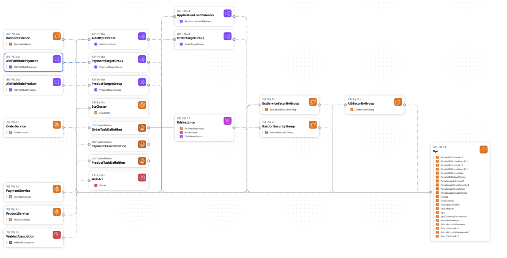

## CloudFormation 배포 

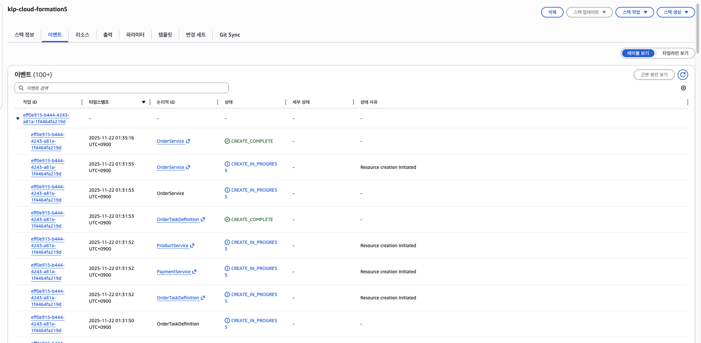

## VPC 리소스 맵 

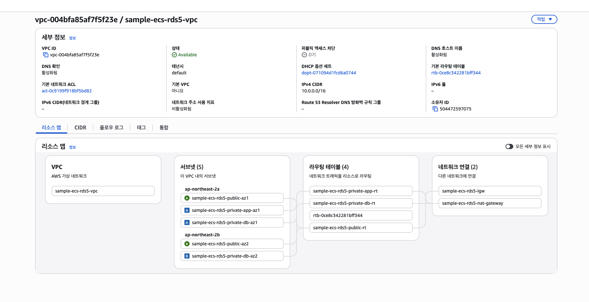

## 보안 그룹 규칙 

### 1. ALB Security Group

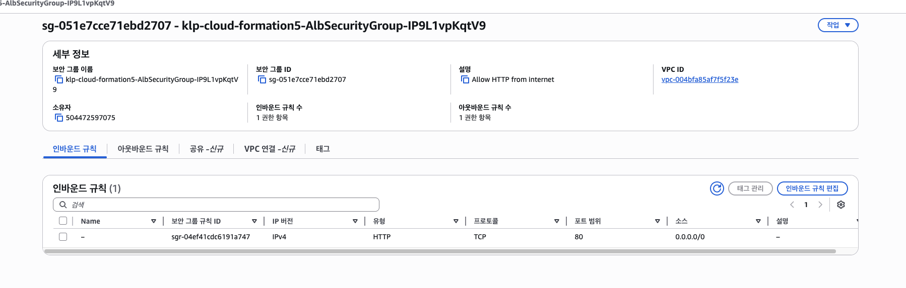

### 2. ECS Service Security Group

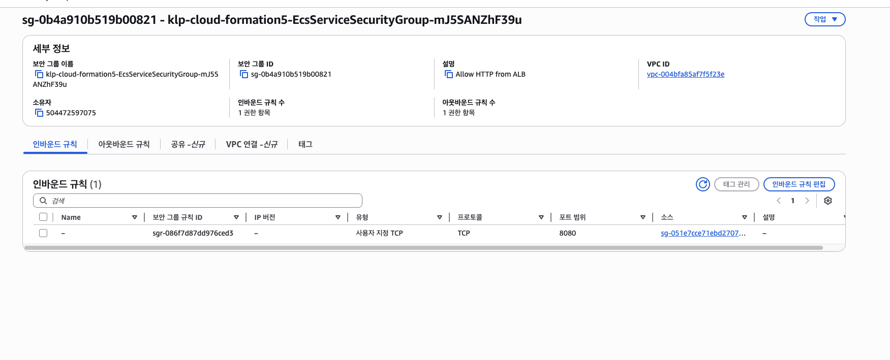

### 3. RDS Security Group

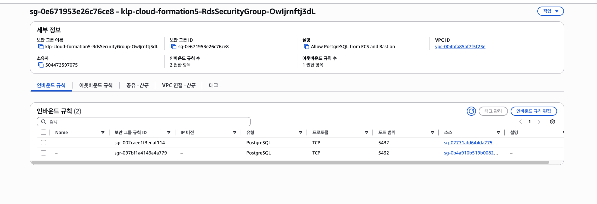

## NAT Gateway

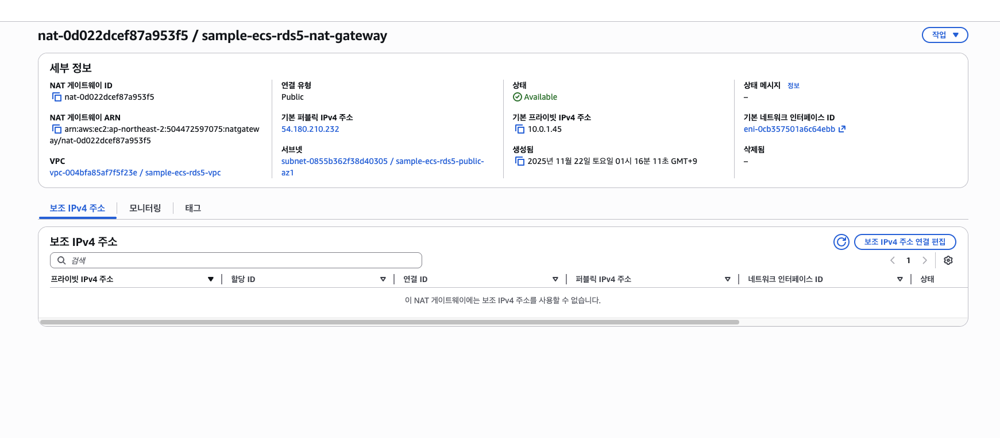

## RDS 인스턴스 

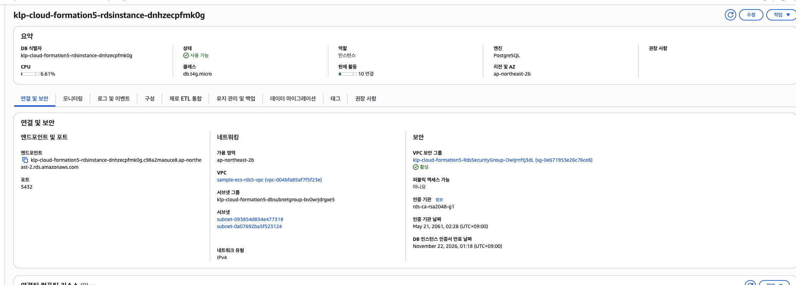

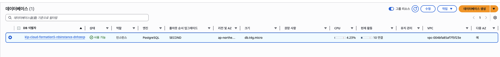

### 멀티 AZ 복제본 

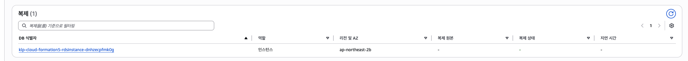

## ECR 레포지토리 

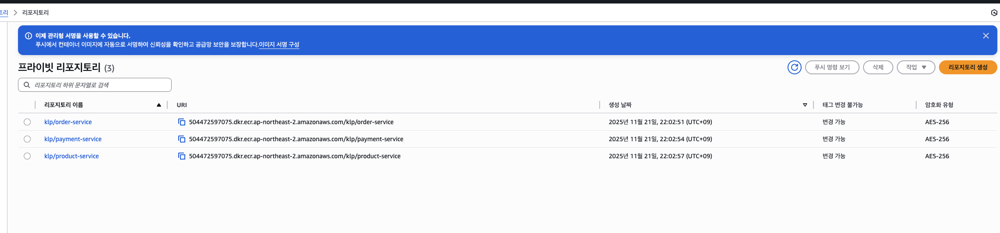

## ECS Service 목록 

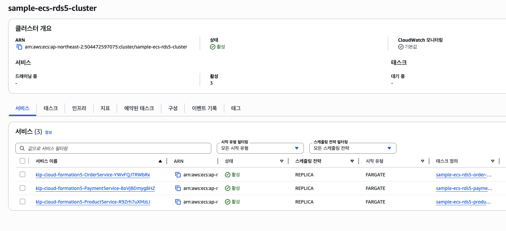

## CloudWatch Order 서비스 로그 

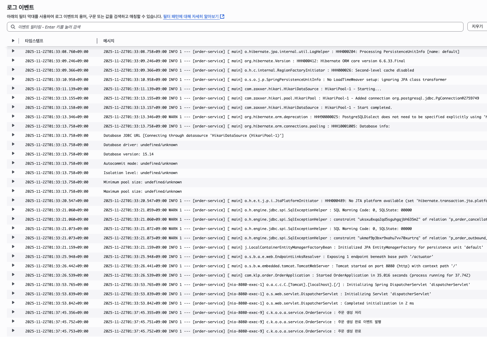

## 응답 API 성공 

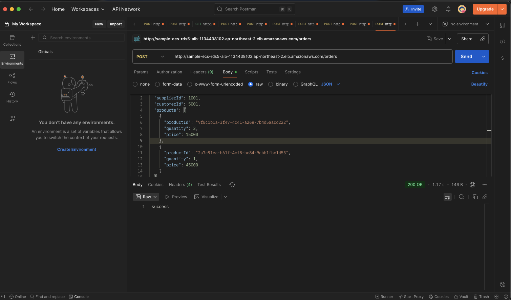

