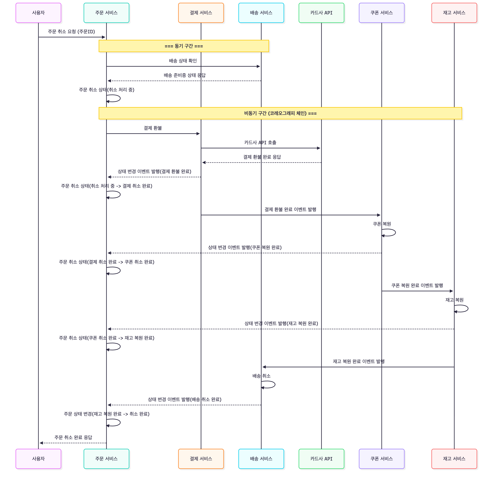
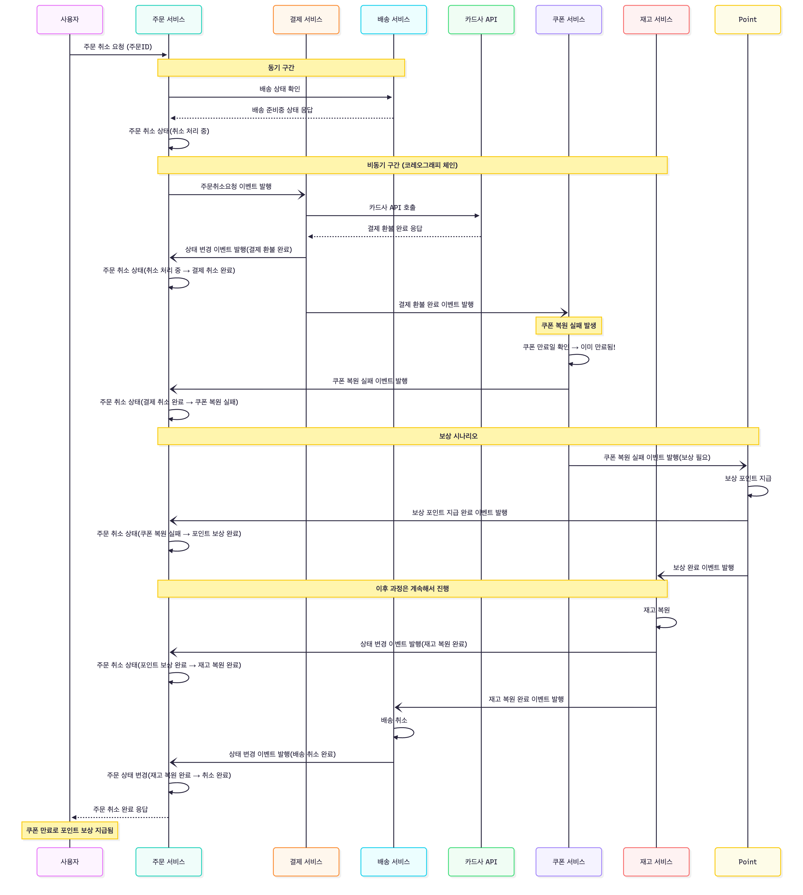
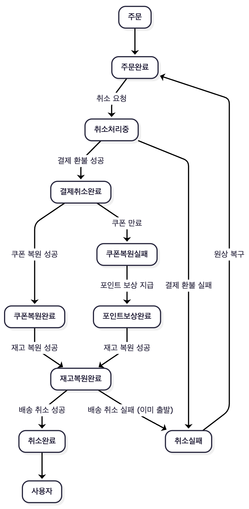

# STEP 1. 시나리오 선택 및 분석

## 🔄 **시나리오 A: 주문 취소 & 환불**

```
[상황]
- 고객이 결제 완료된 주문을 취소 요청
- 결제 수단: 카드 + 쿠폰 + 포인트 복합 사용
- 이미 배송 준비 중인 상태

[처리해야 할 것들]
1. 주문 상태 변경 (취소)
2. 결제 환불 (카드사 API 호출)
3. 쿠폰 복원 (이미 만료됐으면?)
4. 포인트 복원
5. 재고 복원
6. 배송 취소 요청

[실패 시나리오]
- 카드 환불 성공 → 쿠폰 복원 실패 (만료됨) → 어떻게?
- 환불 처리 중 카드사 타임아웃 → 환불됐는지 모름
- 재고 복원했는데 이미 다른 사람이 구매함
```

### 관련 서비스

주문 서비스, 결제 서비스, 쿠폰 서비, 포인트 서비스, 재고 서비스, 배송 서비스

# STEP 2. 설계 점검 체크리스트 ⭐

## 🔄 멱등성 (Idempotency)

| 질문                                | 답변                                                                                                                                                              |
|-----------------------------------|-----------------------------------------------------------------------------------------------------------------------------------------------------------------|
| **같은 환불/취소 요청이 2번 오면 어떻게 처리하나요?** | 요청에 대한 멱등성 보장은 요청시 유니크한 멱등키 (ex. orderId) 를 넘겨주며 요청을 수행하는 쪽에서 `idempotency_key` 테이블에게 “해당 키가 존재하는지와 현재 상태가 무엇인지” 를 조회합니다 . `COMPLETED` 상태인 경우 해당 요청은 수행하지 않습니다. |
| **중복 요청을 어떻게 식별하나요? (어떤 키 사용?)**  | 도메인 특성에 따라 유니크한 ID 를 생성 혹은 조합하여 요청합니다. 요청받는 곳에서는 `eventId` 라는 유니크 제약이 있는 ID 혹은 별도의 생성된 멱등키를 통해 멱등성을 보장합니다.                                                      |

## ⏰ 타임아웃 & 재시도

| 질문                                      | 답변                                                                                                                                                                                                                                                                     |
|-----------------------------------------|------------------------------------------------------------------------------------------------------------------------------------------------------------------------------------------------------------------------------------------------------------------------|
| **외부 API(카드사, PG) 응답이 안 오면 얼마나 기다리나요?** | 외부 API 공식 권장 설정 + 도메인 SLA + 실제 사용자 응답을 기준으로 서비스에 맞는 Timeout 값을 설정합니다. 내부 API를 여러 개 사용하는 경우, 하나의 로직이 일정 시간(ex. 3초)을 넘기지 않도록 Timeout이 구성되어야 합니다.                                                                                                                         |
| **재시도는 몇 번까지, 어떤 간격으로 하나요?**            | 짧은 횟수 + 지수 백오프 형태로 재시도를 수행합니다. 외부 API에 단기간에 많은 요청이 갈 수 있기 때문에 백오프 전략을 같이 사용합니다.                                                                                                                                                                                        |
| **재시도해도 계속 실패하면 최종적으로 어떻게 처리하나요?**      | 최대 재시도 횟수 초과 시 해당 요청은 실패처리하여 사용자에게 실패, 추후 재시도 등의 화면을 나타냅니다. 내부 서비스 로직에 대한 재시도 최종 실패의 경우에는, 동기식 작업의 경우 별도의 로그를 통해 관리자가 확인할 수 있도록 합니다. 또한 비동기 이벤트 처리의 경우 DLQ를 이용하여 추후 관리자 확인 및 추후 수동 개입이 가능하도록 설정합니다. 외부 API 호출에 관한 최종 실패의 경우 사용자에게 관련 내용으로 실패하여 현재는 이용할수 없다는 안내를 전달합니다. |

## 🔀 부분 실패

| 질문                                     | 본인 답변                                                                                                                       |
|----------------------------------------|-----------------------------------------------------------------------------------------------------------------------------|
| **5개 단계 중 3번째에서 실패하면, 1~2번은 어떻게 되나요?** | 주문 상태 변경(취소) → 결제 환불 → 쿠폰 복원 → 포인트 복원 → 재고 복원 → 보상 취소 요청의 흐름에서 쿠폰 복원에서 실패할 경우 성공한 흐름에 대해 역순으로 보상 트랜잭션으로 처리합니다.              |
| **보상 트랜잭션 실행 순서는 어떻게 되나요?**            | 배송 취소 요청 → 재고 복원 → 포인트 복원 → 쿠폰 복원 → 결제 환불 → 주문 상태 변경                                                                        |
| **보상 트랜잭션도 실패하면 어떻게 하나요?**             | 최종 실패한 메시지를 DLQ 에 저장하고 보상 Saga 상태 FAILED로 변경합니다. Slack 또는 email로 관리자에게 알림을 발송하여 관리자가 수동 개입으로 해당 문제를 빠르게 인지하고 처리할 수 있도록 합니다. |

## 📊 상태 관리

| 질문                                  | 본인 답변                                                              |
|-------------------------------------|--------------------------------------------------------------------|
| **현재 트랜잭션이 어느 단계인지 어떻게 알 수 있나요?**   | 작업이 진행될 때마다 처음 시작(주문 상태 변경) 작업의 상태를 변경하는 피드백 이벤트를 이용합니다.           |
| **중간에 서버가 죽었다가 재시작하면 어디서부터 이어가나요?** | 처음 작업의 상태를 파악하고 이를 통해, 현재 작업이 어디까지 진행되었는지를 확인할 수 있으며 이후 작업을 진행합니다. |

# 🚨 예외 케이스 (시나리오별)

## 시나리오 A: 쿠폰이 만료되어 복원 불가하면 어떻게 보상하나요?

- 쿠폰 만료에 대한 부분은 기술적인 문제보다는 비즈니스적인 정책 설정이 더 중요하다고 생각합니다.

- 기간이 만료되어 복원이 불가능하지만 사용자에게 보상을 해야하는 경우 별도의 포인트 지급, 유효기간이 연장된 쿠폰 제공 등의 정책을 통해 보상할 수 있습니다.

# 패턴 선택 및 근거

### Choreography

복합 결제(카드·쿠폰·포인트), 재고 복원, 배송 취소 등 여러 도메인이 동시에 관여하는 주문 취소 프로세스에서는 각 서비스가 자신의 상태와 로직을 독립적으로 처리하는 것이 중요합니다. 코레오그래피 패턴을 사용하면
주문 취소라는 단일 이벤트를 기반으로 각 서비스가 스스로 필요한 후속 작업을 수행하므로 서비스 간 결합도가 낮아지고, 개별 도메인이 외부에 의존하지 않고 책임을 명확히 가질 수 있습니다. 그 결과 기능 확장과 변경이
쉬워지고, 다양한 실패 가능성에도 전체 트랜잭션이 유연하게 흘러갈 수 있습니다.

또한 이 시나리오는 카드 환불 실패, 쿠폰 만료, 배송 취소 불가 등 다양한 오류 상황이 발생할 가능성이 높은데, 이를 중앙 서비스가 모두 조율하려 하면 로직이 복잡해지고 단일 장애 지점(SPOF)이 생기게 됩니다.
반면 코레오그래피 방식에서는 각 서비스가 자신의 실패를 직접 처리하고 다시 이벤트로 알리기 때문에 장애 영향이 최소화되고 복구가 단순해집니다.
적합합니다.

# STEP 3. 아키텍처 설계

## 시퀀스 다이어그램

### 주문 취소 성공 시퀀스



### 쿠폰 복원 실패 시퀀스



## 상태 다이어그램

